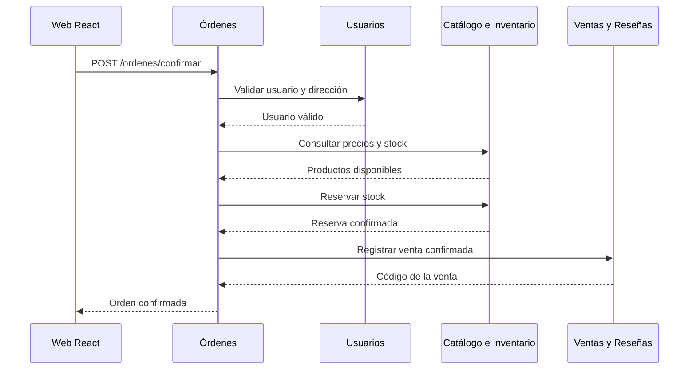

# Sustentación detallada de la arquitectura Backend y Frontend de CloudShop


> **Documento base:** Proyecto Parcial de CS2032 – Cloud Computing, especialmente los requisitos de Backend, Frontend y Diagrama de Arquitectura de las páginas 8, 9 y 11.

---

## 1. Idea general del proyecto

**CloudShop** es un e-commerce académico de productos tecnológicos. La solución permite que un cliente pueda registrarse, iniciar sesión, administrar sus direcciones, consultar productos, revisar el stock, crear una orden, consultar sus compras, publicar reseñas y visualizar indicadores comerciales.

La propuesta no intenta construir una tienda comercial completa. El objetivo es demostrar, de manera integrada, los conceptos solicitados en el proyecto:

- Microservicios independientes.
- Tres lenguajes de programación.
- Dos bases de datos SQL y una NoSQL.
- Comunicación entre APIs REST.
- Contenedores Docker y Docker Compose.
- Despliegue en máquinas virtuales de AWS.
- API Gateway, balanceador privado y AWS Amplify.
- Ingesta de datos, S3, Glue y Athena.

La arquitectura es viable para el proyecto porque el flujo de un e-commerce conecta naturalmente todos estos componentes. No se están creando microservicios solo para completar la rúbrica; cada uno posee una responsabilidad entendible dentro de una compra.

---

## 2. Cómo se lee el diagrama

La imagen se interpreta de arriba hacia abajo:

```text
Cliente
  ↓
Página web React en AWS Amplify
  ↓
API Gateway mediante HTTPS
  ↓
Balanceador de carga privado
  ↓
Dos máquinas virtuales de producción
  ↓
Cinco microservicios ejecutados en Docker
  ↓
Bases de datos privadas o servicios analíticos de AWS
```

La página web es la capa visible para el usuario. API Gateway es la entrada pública de las APIs. El balanceador distribuye las solicitudes entre dos máquinas de producción. En ambas máquinas se ejecuta el mismo conjunto de cinco microservicios. Los datos transaccionales se guardan en una tercera máquina virtual privada y las consultas analíticas se realizan con Athena.

---

## 3. Sustentación de cada capa

## 3.1 Frontend: React en AWS Amplify

La parte superior representa una aplicación **React JavaScript de tipo SPA** desplegada en AWS Amplify.

### Responsabilidades del frontend

- Mostrar el formulario de registro e inicio de sesión.
- Mostrar el catálogo y el detalle de los productos.
- Permitir agregar productos al carrito.
- Enviar la solicitud de creación de una orden.
- Mostrar las órdenes del usuario.
- Mostrar y registrar reseñas.
- Mostrar estadísticas obtenidas desde el microservicio analítico.

### ¿Por qué una SPA?

Una SPA permite navegar entre catálogo, carrito, perfil, órdenes y panel analítico sin recargar completamente el sitio. También facilita separar la interfaz del backend: React no consulta directamente PostgreSQL, MySQL ni MongoDB; solamente consume APIs REST.

### ¿Por qué AWS Amplify?

Se utiliza porque el proyecto exige que la aplicación web sea desplegada en AWS Amplify. La compilación del frontend puede conectarse con un repositorio público y publicar una URL accesible para la demostración.

---

## 3.2 API Gateway como entrada pública

API Gateway es el punto de entrada HTTPS para los cinco microservicios.

Una organización posible de las rutas es:

```text
/api/usuarios/*
/api/catalogo/*
/api/ventas/*
/api/ordenes/*
/api/analitica/*
```

### ¿Por qué es necesario?

- Expone una sola entrada pública para la aplicación.
- Evita mostrar directamente las direcciones y los puertos internos de las EC2.
- Permite enrutar cada ruta hacia el backend correspondiente.
- Cumple el requisito de exponer públicamente las APIs mediante HTTPS.

En la implementación, API Gateway debe conectarse de forma privada con el balanceador dentro de la VPC. El diagrama representa esta integración de manera lógica.

---

## 3.3 Balanceador de carga privado

El balanceador recibe las solicitudes que provienen de API Gateway y decide a cuál máquina virtual de producción enviarlas.

```text
Solicitud 1 → EC2 Producción 1
Solicitud 2 → EC2 Producción 2
Solicitud 3 → EC2 Producción 1
```

### ¿Por qué debe ser privado?

El enunciado solicita un balanceador no público. Por eso el navegador no se comunica directamente con él; el tráfico público termina en API Gateway y luego continúa por la red privada.

### Beneficio principal

Si una de las máquinas deja de responder, el balanceador puede dirigir las solicitudes a la otra, siempre que los health checks estén configurados. También permite demostrar distribución de carga durante la exposición.

---

## 3.4 Dos máquinas virtuales de producción

Las dos EC2 ejecutan el mismo archivo `docker-compose.yml` y, por tanto, contienen una copia de los cinco servicios:

```text
EC2 Producción 1                    EC2 Producción 2
├── usuarios-service               ├── usuarios-service
├── catalogo-service               ├── catalogo-service
├── ventas-resenas-service         ├── ventas-resenas-service
├── ordenes-service                ├── ordenes-service
└── analitica-service              └── analitica-service
```

El diagrama muestra los cinco contenedores una sola vez como representación lógica, pero la implementación debe replicar el mismo stack en ambas EC2.

### ¿Por qué Docker Compose?

- Define los cinco contenedores en un archivo reproducible.
- Mantiene las mismas versiones y variables en ambas máquinas.
- Simplifica iniciar, detener y revisar los servicios.
- Permite que el equipo despliegue el mismo backend sin configuraciones manuales distintas.

---

# 4. Sustentación de los cinco microservicios

## 4.1 Microservicio 1: Usuarios

**Tecnología:** Python + FastAPI  
**Base de datos:** PostgreSQL

### Responsabilidad

Administra la identidad y la información personal del cliente:

- Registro.
- Login.
- Consulta del perfil.
- Actualización del perfil.
- Registro de direcciones de envío.

### Tablas propuestas

```text
usuarios
- id
- nombre
- email
- password_hash
- fecha_registro
- estado

direcciones_envio
- id
- usuario_id
- direccion
- distrito
- ciudad
- pais
- es_principal
```

### Relación

```text
usuarios 1 ───────── N direcciones_envio
```

PostgreSQL es apropiado porque los usuarios y sus direcciones tienen una estructura definida, requieren integridad y se relacionan mediante una clave foránea.

### Métodos REST para demostrar

```http
POST /auth/login
GET  /usuarios/{id}
POST /usuarios/{id}/direcciones
GET  /usuarios/{id}/direcciones
```

---

## 4.2 Microservicio 2: Catálogo e Inventario

**Tecnología:** Java + Spring Boot  
**Base de datos:** MySQL

### Responsabilidad

Administra:

- Categorías.
- Productos.
- Precios.
- Stock disponible.
- Reservas o liberaciones de stock.
- Movimientos de inventario.

### Tablas propuestas

```text
categorias
productos
inventario
movimientos_stock
```

### Relaciones

```text
categorias 1 ───────── N productos
productos  1 ───────── 1 inventario
productos  1 ───────── N movimientos_stock
```

MySQL es apropiado porque el catálogo y el inventario tienen entidades estructuradas y relacionadas. También permite utilizar restricciones y transacciones al modificar el stock.

### Métodos REST para demostrar

```http
GET  /productos
GET  /productos/{id}
POST /inventario/validar
POST /inventario/reservar
POST /inventario/liberar
```

---

## 4.3 Microservicio 3: Ventas y Reseñas

**Tecnología:** Node.js + NestJS  
**Base de datos:** MongoDB

### Responsabilidad

Administra la persistencia de:

- Ventas u órdenes confirmadas.
- Detalle de productos comprados.
- Estados de la compra.
- Reseñas.
- Calificaciones.
- Fotografías opcionales.

### Ejemplo de documento de venta

```json
{
  "orden_id": "ORD-10001",
  "usuario_id": 1520,
  "direccion_id": 2088,
  "items": [
    {
      "producto_id": 320,
      "nombre_producto": "Teclado mecánico",
      "cantidad": 2,
      "precio_unitario": 189.90,
      "subtotal": 379.80
    }
  ],
  "total": 389.80,
  "estado": "CONFIRMADA",
  "fecha_creacion": "2026-09-04T18:30:00Z"
}
```

### Ejemplo de documento de reseña

```json
{
  "usuario_id": 1520,
  "producto_id": 320,
  "puntaje": 5,
  "comentario": "Producto recomendado",
  "fotos": ["foto-01.jpg"],
  "compra_verificada": true
}
```

MongoDB se justifica porque una venta puede contener un arreglo variable de productos y una reseña puede incluir solo estrellas, o también comentario y fotografías.

### Métodos REST para demostrar

```http
POST /ventas
GET  /usuarios/{usuarioId}/ventas
GET  /productos/{productoId}/resenas
POST /productos/{productoId}/resenas
```

### Consumo adicional recomendado

Para cubrir una lectura estricta del requisito de que uno de los microservicios con base de datos consuma otro, este servicio puede consultar al Microservicio 2 antes de guardar una reseña:

```text
Ventas y Reseñas → Catálogo: validar que el producto exista
```

También puede consultar al Microservicio 1 para validar que el usuario exista. Esta validación debe hacerse mediante API, no accediendo directamente a la base de otro servicio.

---

## 4.4 Microservicio 4: Órdenes

**Tecnología:** Python + FastAPI  
**Base de datos:** no posee base de datos propia

### Aclaración del nombre

En la imagen se llama **Órdenes**, pero técnicamente funciona como un **orquestador de la creación de una orden**. No almacena la compra de forma permanente; la persistencia corresponde al Microservicio 3, Ventas y Reseñas.

Esta separación evita duplicar datos:

```text
Microservicio 4, Órdenes → coordina el proceso
Microservicio 3, Ventas  → guarda el resultado final en MongoDB
```

### Flujo de creación de una orden



Si falla el registro en Ventas después de reservar el stock, Órdenes debe solicitar a Inventario que libere la reserva. Esta es una compensación simple que evita dejar stock bloqueado.

### ¿Por qué no necesita base de datos?

Porque no es propietario de usuarios, productos, stock ni ventas. Su función es combinar respuestas de otros servicios y devolver un resultado. De esta manera se cumple el requisito del microservicio sin base de datos que solo consume otros microservicios.

### Métodos REST para demostrar

```http
POST /ordenes/previsualizar
POST /ordenes/confirmar
GET  /ordenes/{id}/estado
POST /ordenes/{id}/cancelar
```

Los métodos de consulta y cancelación llaman internamente al Microservicio 3 y, cuando corresponda, al Microservicio 2.

---

## 4.5 Microservicio 5: Consultas Analíticas

**Tecnología:** Python + FastAPI  
**Fuente analítica:** AWS Athena

### Responsabilidad

Ejecuta consultas SQL sobre los archivos de S3 catalogados por Glue y entrega el resultado al frontend en formato JSON.

### Indicadores propuestos

- Ticket promedio.
- Productos más vendidos.
- Ventas por categoría.
- Ventas por ciudad.
- Clientes con más compras.
- Relación entre calificación y unidades vendidas.

### Métodos REST para demostrar

```http
GET /analitica/ticket-promedio
GET /analitica/productos-mas-vendidos
GET /analitica/ventas-por-categoria
GET /analitica/calificacion-vs-ventas
```

El servicio debe utilizar permisos de AWS mediante un rol de IAM y no almacenar claves permanentes dentro del repositorio.

---

# 5. Tercera máquina virtual privada para bases de datos

La arquitectura separa las bases de datos de las máquinas de producción:

```text
EC2 Bases de Datos privada
├── PostgreSQL
├── MySQL
└── MongoDB
```

### ¿Por qué esta separación es correcta?

- Cumple el requisito de colocar las bases en una tercera MV.
- Evita exponer los motores directamente a Internet.
- Los microservicios se conectan mediante la red privada.
- La máquina de ingesta puede leer los datos con credenciales de solo lectura.
- Cada microservicio utiliza únicamente su propia base.

### Reglas de acceso esperadas

```text
Internet                   ✘ No accede a las bases
Frontend en Amplify        ✘ No accede a las bases
API Gateway                ✘ No accede directamente
EC2 de producción          ✔ Acceso autorizado
MV de ingesta              ✔ Acceso de solo lectura
```

Para la demostración se deben mostrar los Security Groups o reglas equivalentes que prueben que los puertos de PostgreSQL, MySQL y MongoDB no son públicos.

---

# 6. Métodos que consumirá el frontend

El proyecto exige que la web consuma los cinco microservicios y llame al menos dos métodos REST de cada uno.

| Microservicio | Método 1 | Método 2 | Uso en la interfaz |
|---|---|---|---|
| Usuarios | `POST /auth/login` | `GET /usuarios/{id}` | Login y perfil |
| Catálogo e Inventario | `GET /productos` | `GET /productos/{id}` | Catálogo y detalle |
| Ventas y Reseñas | `GET /productos/{id}/resenas` | `POST /productos/{id}/resenas` | Ver y publicar reseñas |
| Órdenes | `POST /ordenes/previsualizar` | `POST /ordenes/confirmar` | Resumen y confirmación de compra |
| Analítica | `GET /analitica/ticket-promedio` | `GET /analitica/productos-mas-vendidos` | Panel de indicadores |

Esta matriz debe convertirse en evidencia real durante la demo; no basta con que aparezca en el documento.

---

# 7. Flujo completo para la demostración

## Caso: un cliente compra un producto

1. El cliente abre la página desplegada en Amplify.
2. Inicia sesión mediante el Microservicio 1.
3. Consulta el catálogo mediante el Microservicio 2.
4. Abre el detalle de un producto y consulta reseñas mediante el Microservicio 3.
5. Agrega productos al carrito.
6. El frontend solicita una previsualización al Microservicio 4.
7. Órdenes valida al usuario y su dirección.
8. Órdenes consulta los precios actuales y el stock.
9. Órdenes solicita reservar el stock.
10. Órdenes solicita al Microservicio 3 registrar la venta.
11. La venta se guarda en MongoDB.
12. El frontend muestra el código de confirmación.
13. El usuario consulta su orden.
14. El panel analítico muestra una métrica obtenida mediante Athena.

Este flujo conecta frontend, API Gateway, balanceador, las dos EC2, los cinco microservicios, las tres bases y el componente analítico.

---

# 8. Por qué el proyecto es viable

## 8.1 Viabilidad funcional

El e-commerce tiene procesos fáciles de comprender y demostrar. Un único escenario de compra permite activar casi toda la arquitectura. Esto reduce la necesidad de inventar casos aislados para cada servicio.

## 8.2 Viabilidad técnica

Las tecnologías seleccionadas son compatibles con APIs REST y contenedores:

- FastAPI para servicios Python.
- Spring Boot para Java.
- NestJS para Node.js.
- PostgreSQL, MySQL y MongoDB ejecutados en contenedores.
- React como cliente de las APIs.

Cada servicio puede desarrollarse y probarse localmente antes del despliegue en AWS.

## 8.3 Viabilidad por alcance

El alcance se mantiene controlado:

- El pago será simulado.
- El envío será simulado.
- El carrito puede mantenerse temporalmente en el navegador.
- No se integrará una pasarela bancaria.
- No se integrarán operadores logísticos reales.
- Las imágenes pueden almacenarse como URLs de prueba.

Estas decisiones conservan el flujo principal y evitan agregar dependencias que no forman parte de la rúbrica.

## 8.4 Viabilidad de los datos

Se puede generar fake data de forma determinística:

| Motor | Tabla o colección con más de 20 000 registros |
|---|---|
| PostgreSQL | `usuarios` o `direcciones_envio` |
| MySQL | `movimientos_stock` |
| MongoDB | `ordenes` o `resenas` |

El volumen es suficiente para demostrar inserción masiva y consultas analíticas sin requerir una infraestructura de gran escala.

## 8.5 Viabilidad para un equipo

El trabajo se puede dividir en paralelo:

| Responsable | Módulo sugerido |
|---|---|
| Integrante 1 | Usuarios + PostgreSQL |
| Integrante 2 | Catálogo e Inventario + MySQL |
| Integrante 3 | Ventas y Reseñas + MongoDB |
| Integrante 4 | Órdenes + integración entre servicios |
| Integrante 5 | Frontend, Analítica e infraestructura compartida |

La integración, Docker Compose, Swagger y AWS deben revisarse como responsabilidad de todo el grupo, aunque exista un encargado principal.

---

# 9. Riesgos y mitigaciones

| Riesgo | Consecuencia | Mitigación propuesta |
|---|---|---|
| Se descuenta stock dos veces | Inventario incorrecto | Usar reserva, identificador de solicitud e idempotencia |
| Falla Ventas después de reservar stock | Stock bloqueado | Órdenes llama a `/inventario/liberar` |
| Un servicio demora demasiado | La compra queda esperando | Configurar timeout y respuesta de error controlada |
| Las dos EC2 tienen versiones distintas | Comportamiento inconsistente | Usar las mismas imágenes Docker y el mismo Compose |
| Las bases quedan públicas | Riesgo de seguridad | Security Groups privados y acceso solo desde backend/ingesta |
| Tipos de identificadores distintos | Fallan cruces analíticos | Definir contratos de IDs desde el inicio |
| La generación de 20 000 datos tarda | Retraso en la demo | Script de carga ejecutado una sola vez y probado previamente |
| Athena aún no tiene datos recientes | Panel desactualizado | Informar que la analítica es por lotes y ejecutar ingesta antes de la demo |

---

# 10. Limitaciones reconocidas

La arquitectura es viable para el proyecto académico, pero no debe presentarse como una plataforma empresarial completamente tolerante a fallos.

- La tercera EC2 de bases de datos es un punto único de falla.
- La ingesta hacia S3 es por lotes, por lo que las métricas no son necesariamente en tiempo real.
- El pago y el envío son simulados.
- No se implementa un sistema distribuido avanzado de transacciones.
- El balanceo protege la capa de aplicación, pero no replica automáticamente las bases.

Reconocer estas limitaciones demuestra que el equipo comprende tanto las ventajas como las restricciones de las herramientas utilizadas.

---

# 11. Evidencias que deben mostrar

## Backend

- `docker ps` en las dos EC2 de producción.
- El mismo `docker-compose.yml` desplegado en ambas.
- Health checks del balanceador.
- Endpoint HTTPS de API Gateway.
- Swagger UI de las cinco APIs.
- Consulta o conteo que demuestre más de 20 000 registros en cada motor.
- Security Groups que prueben que las bases son privadas.
- Repositorios públicos.

## Frontend

- URL de AWS Amplify.
- Consumo real de las cinco APIs.
- Dos métodos REST por microservicio.
- Flujo de compra completo.
- Manejo visible de errores, por ejemplo stock insuficiente.

## Integración

- Una solicitud atendida por EC2 Producción 1.
- Otra solicitud atendida por EC2 Producción 2.
- Órdenes consumiendo Usuarios, Inventario y Ventas.
- Un microservicio con base consumiendo otro, por ejemplo Reseñas validando el producto en Catálogo.

---

# 12. Guion de sustentación oral

> Nuestra solución se llama CloudShop y consiste en un e-commerce de productos tecnológicos. Elegimos este dominio porque permite dividir el sistema en responsabilidades independientes y conectar de manera natural todos los requisitos del proyecto.
>
> En la parte superior tenemos una aplicación React de tipo SPA desplegada en AWS Amplify. Esta web no se conecta directamente a las bases de datos; consume las cinco APIs mediante una única entrada HTTPS en API Gateway.
>
> API Gateway envía las solicitudes al balanceador privado. Detrás del balanceador tenemos dos máquinas virtuales de producción. En ambas ejecutamos el mismo Docker Compose con los cinco microservicios. De esta forma, el balanceador puede distribuir el tráfico y mantener el servicio disponible si una de las máquinas de aplicación deja de responder.
>
> El primer microservicio es Usuarios, desarrollado con Python y FastAPI. Utiliza PostgreSQL para almacenar usuarios y direcciones relacionadas. El segundo es Catálogo e Inventario, desarrollado con Java y Spring Boot. Utiliza MySQL para administrar categorías, productos, inventario y movimientos de stock. El tercero es Ventas y Reseñas, desarrollado con Node.js y NestJS. Utiliza MongoDB porque las ventas contienen arreglos de productos y las reseñas pueden tener estructuras variables.
>
> El cuarto microservicio se llama Órdenes y no tiene base de datos. Su función es orquestar la compra. Primero valida al usuario, luego consulta precios y disponibilidad, reserva el stock y finalmente solicita a Ventas que persista la compra en MongoDB. Si algo falla, solicita liberar el stock. Por eso cumple el requisito de consumir otros microservicios sin almacenar información propia.
>
> El quinto microservicio es Analítica. Está desarrollado en Python y consulta AWS Athena sobre los datos cargados en S3. El frontend utiliza esta API para mostrar ticket promedio, productos más vendidos y ventas por categoría.
>
> Las tres bases de datos se encuentran en una tercera EC2 privada. Solo las máquinas de producción y la máquina de ingesta pueden conectarse a ellas. Con esto evitamos exponer PostgreSQL, MySQL o MongoDB directamente a Internet.
>
> Consideramos viable el proyecto porque el flujo principal es acotado y demostrable. El pago y el envío serán simulados, mientras que nos concentraremos en los elementos evaluados: microservicios, bases de datos, Docker, AWS, comunicación REST, frontend y analítica.

---

# 13. Preguntas probables del profesor

### ¿Por qué Órdenes no tiene base de datos?

Porque es un orquestador. Coordina validaciones y llamadas, pero la venta confirmada se almacena en MongoDB mediante Ventas y Reseñas.

### ¿No se duplica la responsabilidad entre Órdenes y Ventas?

No. Órdenes controla el proceso; Ventas es propietario de la persistencia. Uno ejecuta el caso de uso y el otro guarda el resultado.

### ¿Por qué MongoDB para ventas y reseñas?

Porque una venta contiene una lista variable de ítems y las reseñas pueden tener campos opcionales como comentario o fotografías.

### ¿Por qué no colocar las bases dentro de cada EC2 de producción?

Porque el enunciado exige una tercera MV privada. Además, si cada EC2 tuviera su propia base sin replicación, podrían generarse datos diferentes.

### ¿Qué ocurre si falla una EC2?

El balanceador puede enviar las nuevas solicitudes a la otra EC2, siempre que los health checks estén configurados.

### ¿Qué ocurre si falla la venta después de reservar stock?

Órdenes ejecuta una compensación y solicita a Inventario liberar la reserva.

### ¿La analítica es en tiempo real?

No necesariamente. Es una arquitectura por lotes: la MV de ingesta copia los datos a S3 y Athena consulta la última carga disponible.

### ¿Está lista para producción comercial real?

No completamente. Es viable para el alcance académico. Una versión empresarial requeriría alta disponibilidad de bases, observabilidad avanzada, gestión de secretos, recuperación ante desastres y una pasarela de pago real.

---

# 14. Conclusión

CloudShop es una propuesta coherente con la rúbrica porque integra cinco microservicios, tres lenguajes, tres motores de base de datos, un servicio sin persistencia, un servicio analítico, dos EC2 de producción, balanceador privado, API Gateway, Amplify y bases privadas.

La viabilidad depende de mantener el alcance controlado y demostrar cada requisito con evidencia real. El diagrama explica la estructura; la nota se obtiene mostrando que los contenedores, APIs, bases de datos, balanceo, frontend y consultas funcionan de extremo a extremo.
